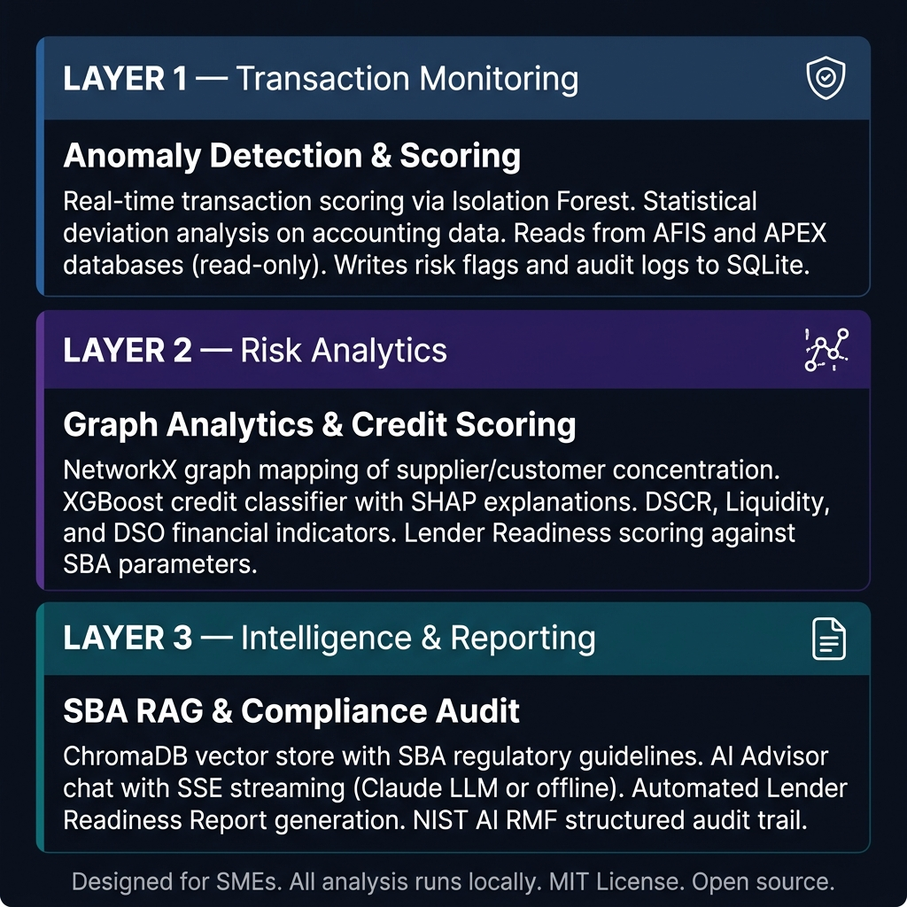
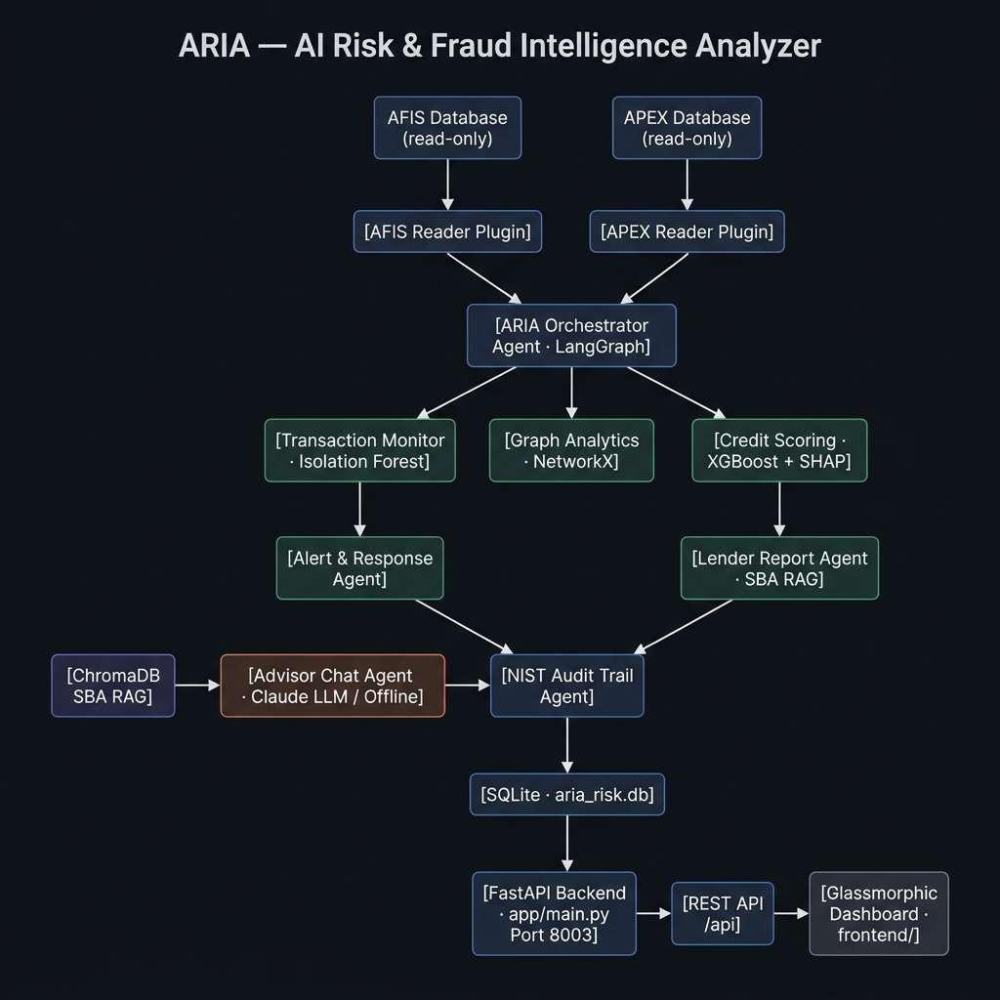
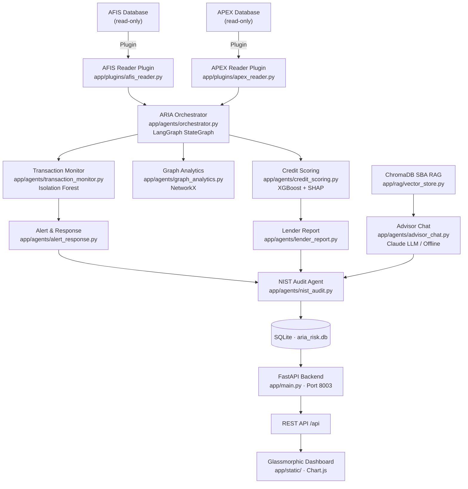

# ARIA — AI Risk & Fraud Intelligence Analyzer

[](https://opensource.org/licenses/MIT)
[](https://www.python.org/)
[](https://fastapi.tiangolo.com/)
[](https://github.com/langchain-ai/langgraph)
[](https://xgboost.readthedocs.io/)
[](https://airc.nist.gov/RMF)

> **An open-source AI risk and fraud intelligence system for SMEs — continuous transaction monitoring, graph-based supplier concentration analysis, XGBoost credit scoring with SHAP explanations, and SBA-aligned lender readiness reports.**

ARIA is an open-source operational risk and fraud intelligence analyzer. It reads financial data from connected AFIS and APEX databases, runs continuous anomaly scoring via Isolation Forest, maps supplier and customer concentration through network graphs, evaluates credit eligibility with explainable machine learning, and produces SBA-aligned lender readiness reports — all running locally with full NIST AI RMF audit traceability.

---

## How It Works — Three Integrated Layers



### Layer 1 — Transaction Monitoring

Reads transaction records from AFIS and APEX databases in read-only mode. Scores each transaction with an Isolation Forest anomaly model. Detects statistical deviations in volume, frequency, and counterparty patterns. Writes risk flags and structured audit logs to a local SQLite database.

```
Input:  AFIS financial transactions + APEX AR/AP records (read-only)
Output: Anomaly scores · risk flags · structured audit log entries
```

### Layer 2 — Risk Analytics

Constructs a NetworkX entity graph mapping the SME's relationships with suppliers and customers — detecting critical revenue concentration risks. Evaluates credit eligibility using an XGBoost classifier trained on DSCR, Liquidity, and DSO indicators, with SHAP values providing per-decision explanations. Scores Lender Readiness against SBA underwriting parameters.

```
Input:  Flagged transactions + financial KPIs from AFIS
Output: Graph concentration risk · credit score · SHAP explanation · SBA readiness rating
```

### Layer 3 — Intelligence & Reporting

A ChromaDB vector store holds SBA regulatory guidelines, enabling an AI Advisor chat agent with Server-Sent Events (SSE) streaming. Generates automated Lender Readiness Reports in the format expected by SBA lenders. All agent decisions, model outputs, and LLM interactions are logged to a NIST AI RMF structured audit trail.

```
Input:  Credit scores + graph analysis + SBA RAG
Output: Lender report · advisor chat responses · NIST audit records
```

---

## Technical Architecture





### REST API Surface

| Endpoint | Method | Description |
|---|---|---|
| `/api/alerts` | `GET` | Active risk alerts and anomaly flags |
| `/api/credit` | `GET / POST` | Credit score computation and SHAP explanation |
| `/api/graph` | `GET` | Entity graph — supplier/customer concentration map |
| `/api/chat` | `POST` | SSE streaming AI Advisor query (SBA RAG) |
| `/api/system` | `GET` | System status, AI mode (`llm` or `offline`), version |

### Stack

| Component | Technology |
|---|---|
| Backend | FastAPI 0.115 (Python 3.11+) |
| Agent Orchestration | LangGraph 0.2.39 · LangChain |
| Anomaly Detection | scikit-learn · Isolation Forest |
| Credit Scoring | XGBoost 2.1.2 · SHAP 0.46.0 |
| Graph Analysis | NetworkX 3.4.2 |
| RAG | ChromaDB 0.5.15 · sentence-transformers |
| AI Narrative | Anthropic Claude (optional) · offline fallback |
| Report Generation | WeasyPrint · Jinja2 |
| Database | SQLite · SQLAlchemy |
| Dashboard | HTML + CSS + JavaScript · Chart.js |
| Testing | pytest · pytest-asyncio · httpx |

---

## Key Design Decisions

**Read-only data access.** ARIA never writes to AFIS or APEX databases. All reads are through isolated plugin connectors (`afis_reader.py`, `apex_reader.py`), ensuring zero impact on source systems.

**Explainable ML.** The XGBoost credit classifier uses SHAP (SHapley Additive exPlanations) to provide per-decision feature attributions — every credit score is accompanied by a human-readable breakdown of which indicators drove the rating.

**SBA-grounded reporting.** The Lender Readiness Report is generated from a RAG pipeline seeded with SBA SOP 50 10 guidelines, ensuring reports align with standard underwriting expectations.

**Zero-server dependency.** SQLite and ChromaDB both run locally. The full risk analysis stack — including the RAG advisor — starts with `python run.py`.

**NIST AI RMF 1.0 alignment.** Every agent decision, model inference, and LLM interaction is logged with timestamps and structured metadata to a persistent `audit_log` table, following NIST governance principles: validity, reliability, explainability, and human oversight.

---

## Who Is This For?

ARIA is built for SME finance directors, compliance officers, and the accountants and advisors who serve them — providing enterprise-grade risk intelligence without enterprise software costs.

**You do not need a data science background.** Connect ARIA to your existing AFIS and APEX instances and run `python run.py`. ARIA reads the data, scores the risk, and generates reports automatically.

---

## Quickstart

```bash
git clone https://github.com/afild/ARIA.git
pip install -r requirements.txt
python run.py
```

Open `http://localhost:8003/static/index.html` in your browser.

---

## AI Modes

**LLM Mode** — set the environment variable and restart:

```bash
# Linux/macOS
export ANTHROPIC_API_KEY=your_key_here

# Windows
set ANTHROPIC_API_KEY=your_key_here

python run.py
```

**Offline Mode** (default): Isolation Forest, XGBoost, NetworkX, and ChromaDB all operate with zero API calls. The AI Advisor degrades gracefully to deterministic SBA guideline lookups.

---

## Getting Started

### Prerequisites
- Python 3.11 or higher
- Git

### Installation

```bash
# 1. Clone
git clone https://github.com/afild/ARIA.git

# 2. Virtual environment
python -m venv venv
source venv/bin/activate   # Windows: venv\Scripts\activate

# 3. Dependencies
pip install -r requirements.txt

# 4. Configure
cp .env.example .env
# Optionally add ANTHROPIC_API_KEY

# 5. Launch
python run.py
```

### Running Tests

```bash
pytest tests/ -v
```

---

## NIST AI RMF 1.0 Alignment

| NIST Function | ARIA Implementation |
|---|---|
| **GOVERN** | MIT License · open audit logs · traceable agent decision chain |
| **MAP** | Risk domain scoped to SME operational and credit risk · documented model assumptions |
| **MEASURE** | Automated pytest suite · SHAP feature attribution per score · anomaly confidence per transaction |
| **MANAGE** | Read-only data access · offline fallback · human-review alerts · explainable XGBoost |

The AI Advisor sends only aggregated financial metrics and anonymized risk summaries to the LLM API — never raw transaction records or personally identifiable data.

---

## Repository Structure

```
ARIA/
├── app/
│   ├── main.py                      ← FastAPI app · lifespan · RAG init · static serving
│   ├── config.py                    ← Pydantic settings
│   ├── llm_client.py                ← Provider-agnostic LLM client (Claude + offline)
│   ├── agents/
│   │   ├── orchestrator.py          ← LangGraph StateGraph · agent coordination
│   │   ├── transaction_monitor.py   ← Isolation Forest anomaly scoring
│   │   ├── graph_analytics.py       ← NetworkX entity graph · concentration detection
│   │   ├── credit_scoring.py        ← XGBoost classifier · SHAP explanations
│   │   ├── lender_report.py         ← SBA RAG report generation · WeasyPrint PDF
│   │   ├── alert_response.py        ← Alert consolidation and action triggers
│   │   ├── advisor_chat.py          ← SSE streaming chat · SBA Q&A
│   │   └── nist_audit.py            ← NIST-aligned structured audit logger
│   ├── api/
│   │   ├── router.py
│   │   ├── alerts.py
│   │   ├── chat.py
│   │   ├── credit.py
│   │   ├── graph.py
│   │   └── system.py
│   ├── database/
│   │   ├── db_manager.py
│   │   ├── models.py
│   │   └── schema.sql               ← Tables: risk_alerts · credit_scores · audit_log
│   ├── plugins/
│   │   ├── afis_reader.py           ← Read-only AFIS connector
│   │   ├── apex_reader.py           ← Read-only APEX connector
│   │   ├── credit_bureau.py
│   │   └── report_generator.py
│   ├── rag/
│   │   ├── vector_store.py          ← ChromaDB init · embedding · retrieval
│   │   └── sba_guidelines/          ← SBA SOP 50 10 source documents
│   ├── skills/
│   │   ├── compute_credit_score.py
│   │   ├── build_entity_graph.py
│   │   ├── explain_risk.py
│   │   ├── generate_lender_memo.py
│   │   └── score_transaction.py
│   └── static/                      ← Glassmorphic dashboard (HTML + CSS + JS)
├── docs/
│   └── images/                      ← Architecture diagrams
├── tests/
│   ├── conftest.py
│   ├── test_api.py
│   ├── test_credit_scoring.py
│   ├── test_lender_report.py
│   └── test_transaction_monitor.py
├── .env.example
├── ARIA_SDD_harness.md              ← System Design Document
├── CHANGELOG.md
├── LICENSE
├── requirements.txt
└── run.py
```

---

## Contributing

Areas where contributions are most needed:
- Additional ML models for credit scoring (LightGBM, CatBoost)
- EDGAR / SEC financial data integration for public company benchmarking
- Multi-language SBA document support in the RAG pipeline
- Docker Compose setup for zero-dependency deployment

---

## Changelog

### Latest: v0.1.0
- Full risk analysis pipeline: transaction monitoring, graph analytics, credit scoring, SBA RAG, NIST audit

---

## License

MIT License — free to use, adapt, and redistribute.


